# Architecture

How OpenModal works under the hood — from `openmodal run` to a running container on your cloud.

## The big picture

OpenModal is an orchestration layer on top of Kubernetes. Your code gets packaged into a Docker image, pushed to a container registry, and runs as a Kubernetes pod on your cloud.

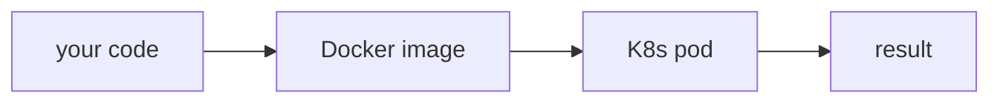

Under the hood, three systems are involved:

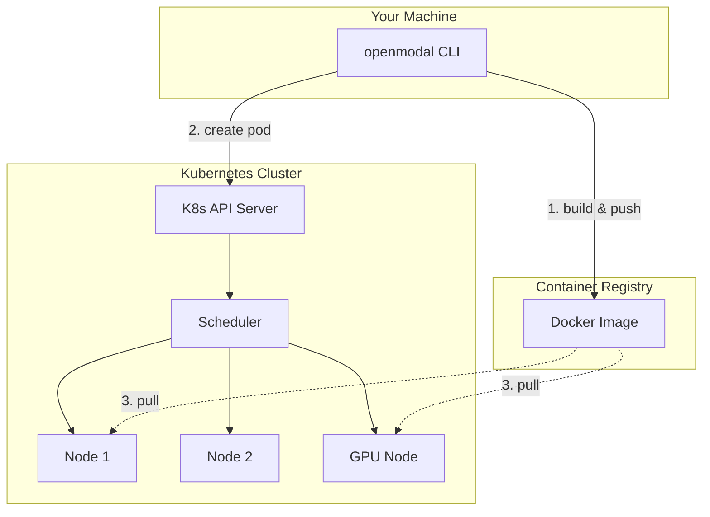

1. **Container Registry** (Artifact Registry, ECR, or ACR) — stores your Docker images
2. **K8s API Server** — accepts pod creation requests
3. **Scheduler** — places pods on nodes with enough CPU, memory, and GPUs

## What happens when you run `openmodal run app.py`

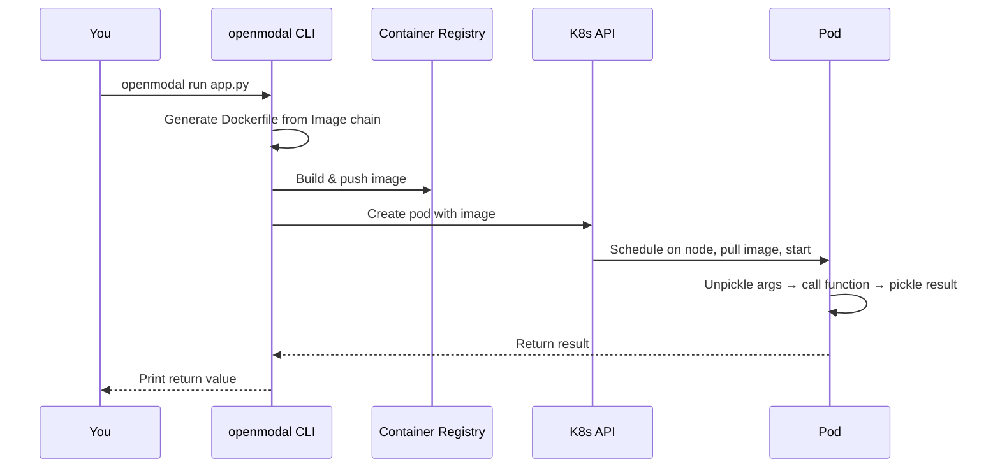

### Step by step

**1. Image build.** OpenModal reads the `Image` chain (`.apt_install()`, `.pip_install()`, etc.) and generates a Dockerfile. It builds the image and pushes it to a registry.

| Provider | Registry | Build method |
|---|---|---|
| GCP | Artifact Registry | Cloud Build (remote, no local Docker needed) |
| AWS | ECR | Local `docker build` + push |
| Azure | ACR | Local `docker build` + push |
| Local | None | Local `docker build` (no push) |

**2. Pod creation.** OpenModal creates a Kubernetes pod spec with your image, resource requests, GPU requirements, env vars, and volumes, then submits it to the K8s API.

**3. Scheduling.** The scheduler finds a node with enough free resources. If nothing fits, the pod stays `Pending` and the cluster autoscaler adds a new node (see [Cluster autoscaling](#cluster-autoscaling)).

**4. Image pull.** The node pulls the image from the registry. First pull is slow (2-30s depending on image size). Subsequent pulls on the same node use cached layers.

**5. Execution.** The container runs the OpenModal agent, which unpickles your function arguments, calls your function, pickles the result, and sends it back (see [Remote function execution](#remote-function-execution)).

## Image building

The `Image` class is a chainable Dockerfile generator. Each method call appends a line to the Dockerfile:

```python
image = (
    openmodal.Image.debian_slim()         # FROM ubuntu:24.04 + python 3.12
    .apt_install("git", "curl")           # RUN apt-get install -y git curl
    .pip_install("torch", "transformers") # RUN pip install torch transformers
    .run_commands("echo setup done")      # RUN echo setup done
)
```

This generates:

```dockerfile
FROM ubuntu:24.04
ENV DEBIAN_FRONTEND=noninteractive
RUN curl -sSL <python-build-standalone-url> | tar xz -C /usr/local ...
RUN apt-get update && apt-get install -y git curl ...
RUN pip install torch transformers
RUN echo setup done
RUN pip install openmodal
COPY your_app.py /opt/your_app.py
CMD ["python", "-m", "openmodal.runtime.agent"]
```

Python is installed via [python-build-standalone](https://github.com/astral-sh/python-build-standalone) (pre-compiled binaries from Astral). This means any Python version (3.10–3.13) works on any base image — you're not tied to the distro's Python.

### Image caching

Images are content-hashed. If the Dockerfile and source files haven't changed, OpenModal skips the build entirely and reuses the existing image from the registry.

## Sandboxes

Sandboxes are long-running containers you can exec commands into — like SSH-ing into a machine. They're used by coding agents (CooperBench, Harbor/SWE-bench) that need to run bash commands, edit files, and run tests inside a codebase.

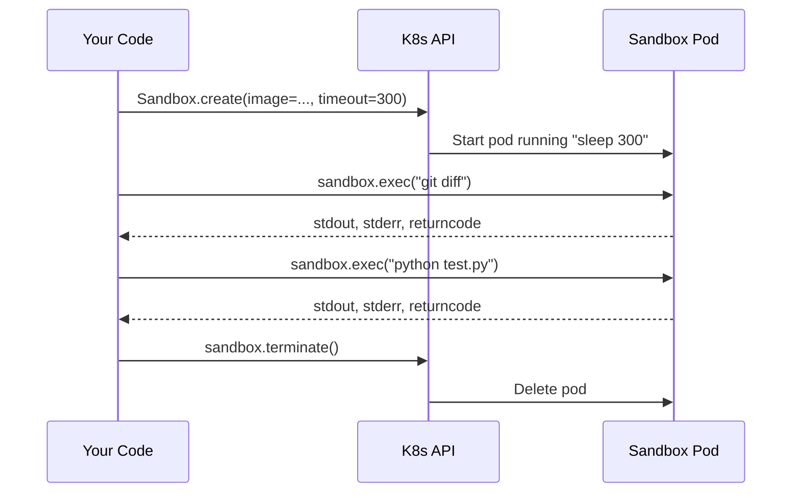

The pod runs `sleep <timeout>` as its main process — this keeps the container alive while you exec commands into it. Each `exec` call runs a separate process inside the same container, sharing the same filesystem. Under the hood, `exec_in_pod` uses the Kubernetes exec API (websocket to the kubelet). On local Docker, it's just `docker exec`.

### Default resource requests

Every sandbox pod requests **0.25 CPU and 256 MB RAM**. This is important for autoscaling — it tells the scheduler how many pods fit on a node:

```
e2-standard-8 node (8 CPU, 32 GB RAM)
→ fits ~32 sandbox pods at 0.25 CPU each
```

Without resource requests, the scheduler thinks every pod needs zero resources, packs them all on one node, and the autoscaler never adds more nodes.

## Remote function execution

When you call `f.remote(x)`, your arguments are serialized (pickled), sent to a pod, and the result is pickled back:

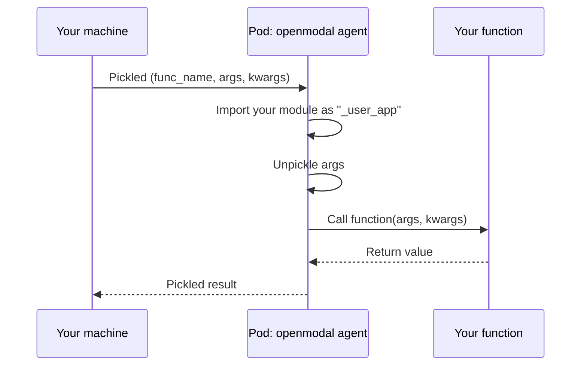

The agent registers your module as `_user_app` in `sys.modules` **before** unpickling. This is critical — when you pass a dataclass or Pydantic model as an argument, Python pickles it with the module path (e.g., `_user_app.TrainingConfig`). The agent needs that module to exist to reconstruct the object.

### `f.map()` — parallel execution

`f.map(inputs)` creates one pod per input and runs them in parallel across the cluster:

```mermaid
graph TB
    Client[Your machine]
    Client -->|"f.map([a, b, c, d])"| Pool[ThreadPoolExecutor]
    Pool --> Pod1[Pod 1: f-a]
    Pool --> Pod2[Pod 2: f-b]
    Pool --> Pod3[Pod 3: f-c]
    Pool --> Pod4[Pod 4: f-d]
    Pod1 -.->|result| Client
    Pod2 -.->|result| Client
    Pod3 -.->|result| Client
    Pod4 -.->|result| Client
```

Each pod runs on potentially different nodes. Results are yielded as they complete — you don't wait for all pods to finish before getting the first result.

## GPU serving and scale-to-zero

When you deploy a web server (e.g., vLLM), OpenModal creates a GPU pod and monitors it for idle connections. If nobody connects for `scaledown_window` seconds, the pod is deleted and the GPU is released.

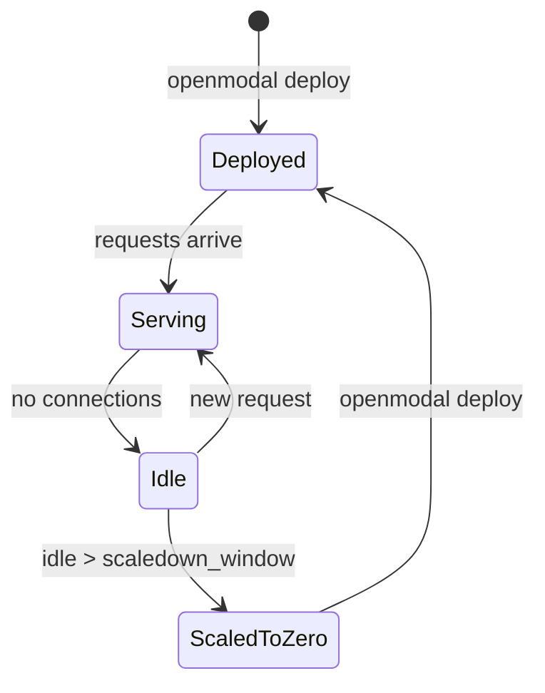

### How it works per provider

- **GCP**: A CronJob runs every 60 seconds, checks active connections via a shell script, and deletes the pod if idle
- **AWS / Azure**: KEDA (Kubernetes Event-Driven Autoscaler) watches metrics and scales the deployment to zero replicas when idle

### Cost

| State | What's running | Approximate cost |
|---|---|---|
| Serving requests | GPU node + pod | ~$1.20/hr (H100 spot) |
| Idle, within scaledown window | Same | Same |
| Scaled to zero | Control plane + default node | ~$0.10/hr |
| Cluster deleted | Nothing | $0 |

## Cluster autoscaling

When many pods are created at once (e.g., CooperBench running 60 agents), the cluster scales up automatically.

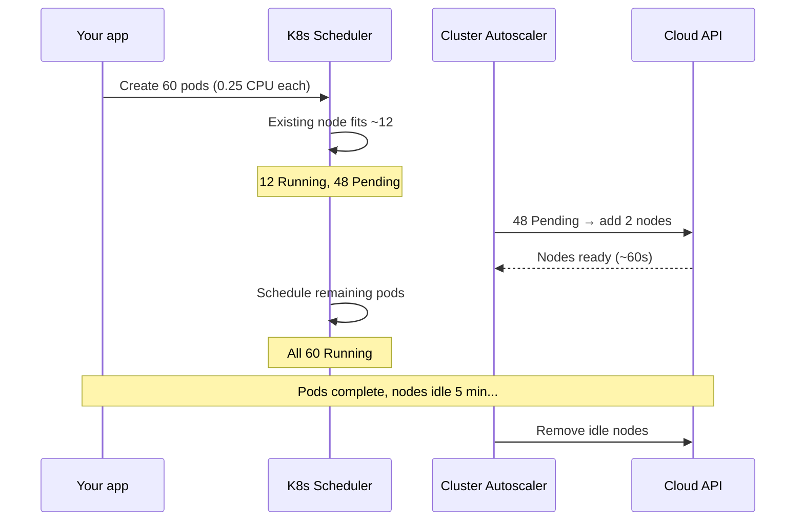

The key: **pods must have resource requests**. The scheduler uses requests to decide how many pods fit on a node. Without requests, everything gets packed onto one node and the autoscaler never fires.

### Provider comparison

| | GCP (GKE) | AWS (EKS) | Azure (AKS) |
|---|---|---|---|
| Autoscaler | GKE cluster autoscaler | Karpenter | AKS cluster autoscaler |
| Sandbox nodes | `e2-standard-8` pool | Karpenter picks best fit | `Standard_D8s_v5` |
| Max nodes | 100 per zone | 100 CPU limit | 100 |
| Scale-up time | ~60s | ~30-60s | ~60-90s |
| GPU nodes | Separate pool per GPU type | Karpenter auto-provisions | Separate pool per GPU |

## Volumes

Volumes sync data between cloud storage and pod filesystems. No CSI drivers or IAM admin permissions needed — it uses init containers and sidecars.

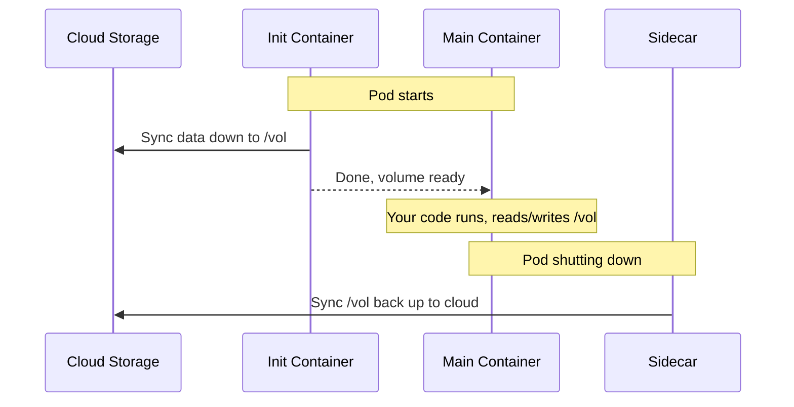

All three containers (init, main, sidecar) share an `emptyDir` volume — an ephemeral disk on the node. The init container downloads data before your code starts. The sidecar uploads changes when the pod shuts down.

| Provider | Cloud storage | Sync tool |
|---|---|---|
| GCP | GCS bucket | `gcloud storage rsync` |
| AWS | S3 bucket | `aws s3 sync` |
| Azure | Azure Blob | `az storage blob sync` |
| Local | `~/.openmodal/volumes/` | Direct bind mount |

## Networking

How your machine talks to pods differs by provider:

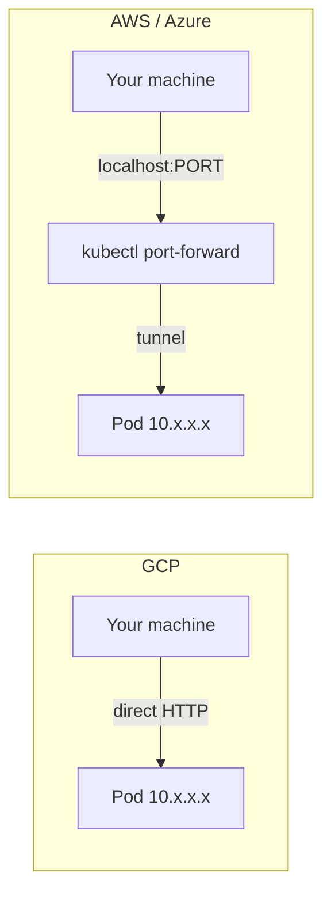

| Provider | How | Why | Latency overhead |
|---|---|---|---|
| GCP | Direct pod IP | GKE pods get routable IPs | ~0ms |
| AWS | `kubectl port-forward` | EKS pod IPs are VPC-internal | ~100ms |
| Azure | `kubectl port-forward` | AKS pod IPs are VPC-internal | ~100ms |
| Local | Container IP / `docker exec` | Docker bridge network | ~0ms |

This matters for web servers (vLLM, FastAPI). For sandboxes, all providers use the K8s exec API which has similar latency everywhere.

## Provider abstraction

All providers implement the same `CloudProvider` interface. Your code never touches the provider directly.

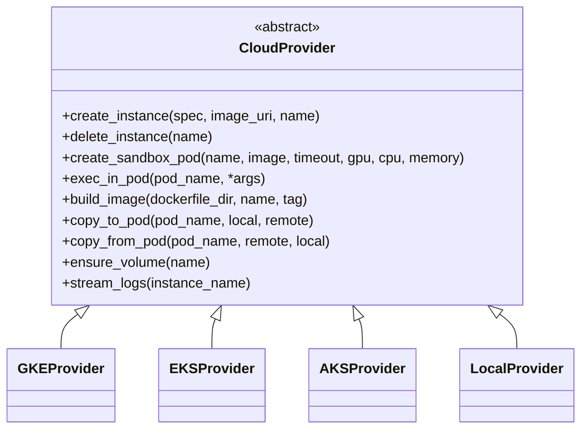

The provider is selected by:

- CLI flag: `--local`, `--aws`, `--azure` (GCP is the default)
- Environment variable: `OPENMODAL_PROVIDER=local|gcp|aws|azure`

Switching providers changes where your code runs, not how you write it.
